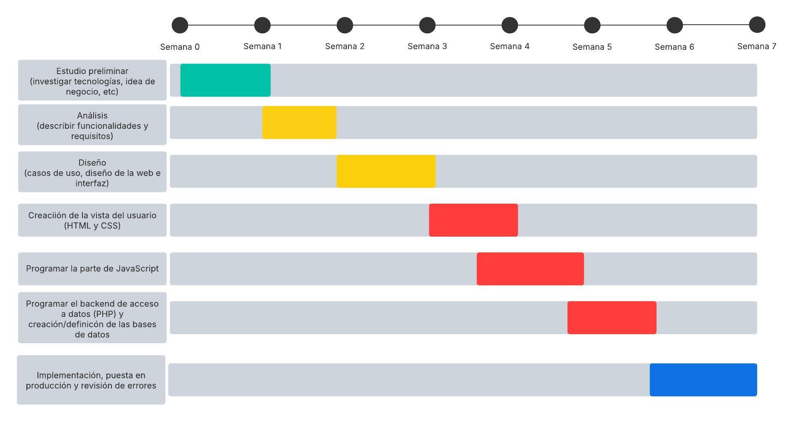

# Anteproxecto

- [Anteproxecto](#anteproxecto)
  - [1- Idea del proyecto](#1--idea-del-proyecto)
  - [2- Contextualización](#2--contextualización)
  - [3- Estudio de alternativas y viabilidad](#3--estudio-de-alternativas-y-viabilidad)
    - [3.1- Estudio de alternativas](#31--estudio-de-alternativas)
    - [3.2 Justificación de la alternativa](#32-justificación-de-la-alternativa)
  - [4- Requisitos técnicos](#4--requisitos-técnicos)
  - [5- Planificación](#5--planificación)

## 1- Idea del proyecto

El proyecto está enfocado en la creación de un sitio web dedicado a la venta de merchandising del canal [zomly Games](https://www.youtube.com/c/zomlyGames), del cual soy propietario, ubicado en la plataforma de vídeo YouTube. Merchandising hace referencia a productos licenciados, aquellos que se venden apoyados en la marca de otro producto o servicio. En este caso, estos productos estarían apoyados por la marca de mi canal.

## 2- Contextualización

Este proyecto surge como respuesta a la necesidad del canal de publicitarse y de generar ingresos. Consistirá principalmente en un punto de venta online donde se ofrecerá a los posibles clientes productos exclusivos y únicos que contendrán el logotipo y/o nombre del canal, tales como camisetas, chapas, sudaderas, viseras, etc. De esta manera, no solo se consigue el objetivo de dar más visibilidad a la marca, si no que, a la vez, se puede convertir en una fuente pasiva de ingresos para el canal.

Esta aplicación abrirá la oportunidad de negocio, ya que, como mencioné antes, el objetivo principal de esta es vender productos. Además, será posible comercializarla mediante estrategias relativas a las características de los productos, al precio y la competencia, a la distribución y a las estrategias de comunicación y promoción.

Las estrategias relacionadas con las características de los productos se compondrán de: una variedad de artículos distintos para adaptarse a cada cliente (si solo vendiese, por ejemplo, viseras, cualquier persona que no use viseras en su vida cotidiana no estaría interesada en comprar en la web), de un precio acorde al valor de la marca (cuánto más popular sea la marca, mayores serán los precios y viceversa) y de unos materiales de buena calidad, pero a la vez asequibles. Una característica extra que también mencioné en otros apartados, pero que considero importante mencionar aquí es que la principal característica de estos productos (por encima de las anteriormente mencionadas) es que estos productos son únicos, es decir que ninguna otra persona, entidad o empresa podrá crear productos como estos, y exclusivos, ya que solo podrá existir 1 único sitio web como este y solo este podrá vender los productos.

En relación a la competencia, como tal no existirá competencia de los productos en sí mismos o de la web ya que son únicos, si no que más bien sería cuestión de la competencia que suponen otros creadores de contenido al crecimiento de mi canal, lo cual está estrechamente relacionado con las ventas y popularidad de los propios productos.

Por último, quedarían por determinar las estrategias de distribución y promoción. Estos productos se fabricarán y distribuirán mediante la contratación de los servicios de empresas de creación de merchandising/productos a medida y de empresas de reparto respectivamente. La promoción del sitio web se haría en los propios vídeos del canal de YouTube y en otras plataformas de redes sociales. También se podrían llevar a cabo ventas de productos por tiempo limitado de colaboraciones con otros creadores de contenido, entre otros métodos para publicitar la web y sus productos.

## 3- Estudio de alternativas y viabilidad

### 3.1- Estudio de alternativas

Mi canal de YouTube precisa un sitio web para vender merchandising a los subscriptores. Analizo 4 alternativas para su desarrollo:

Alternativas

- A1- Framework Angular + Firebase + Firestore
- A2- Framework Angular + NestJS (Backend con TypeScript)
- A3- Desarrollo desde cero modelo MVC en php + HTML5 + CSS3 + javascript nativo.
- A4- Desarrollo desde cero con API Rest Node.js + HTML5 + CSS3 + javascript nativo

| **Alternativa** | **Viabilidad técnica** | **Viabilidad económica** | **Temporalidad** | **Valoración Global** |
| ------ | ------ | ------ | ------ | ------ |
| A1 | Media (5/10): Angular usa TypeScript que, en pocas palabras, es JavaScript pero con tipado estricto (siendo en tiempo de compilación, a diferencia de JS, que es en tiempo de ejecución); por lo tanto, esto sería sencillo de aprender, pero debido a que Angular cuenta con muchas funcionalidades y conceptos nuevos (componentes, suscripciones, pipes, etc) esta opción acaba teniendo una curva de aprendizaje considerable. Firebase y Firestore no tienen una curva de aprendizaje importante (no necesitas gestionar ni configurar servidores ni infraestructura). **Fortalezas**: Escalable, simplicidad en el backend y frontend organizado (HTML+CSS+TypeScript dividido en componentes). **Debilidades**: Curva de aprendizaje relevante. | Alta (8/10): Requiere comprar un dominio y configurarlo en Firebase Hosting, el resto de aspectos son gratuitos, pero limitados hasta cierto punto (a partir de cierta cantidad de recursos que se necesiten en la web, habrá que pagar por hosting, almacenamiento, nº de usuarios activos, etc). | Viabilidad media (5/10): curva de aprendizaje de Angular. Duración entre 3 y 4 meses. | **6/10** |
| A2 | Baja (3/10): NestJS usa TypeScript, por lo tanto, esto sería sencillo de aprender, pero debido a que NodeJS cuenta con funcionalidades y conceptos similares a Angular y que además esta alternativa también incluye Angular para frontend, acaba teniendo una curva de aprendizaje muy elevada. **Fortalezas:** Estructura organizada, tanto en frontend como en backend y también escalable. **Debilidades:** Exceso de complejidad para un solo desarrollador sin experiencia en frameworks. | Media (6/10): Herramientas gratuitas. Requiere hosting del backend entre 5-7 €/mes, adquirir dominio y certificados SSL (la Alternativa 1 no necesita SSL, ya que Firebase lo proporciona gratuitamente por defecto). | Viabilidad baja (3/10): curva de aprendizaje elevada (4-5 meses). | **4/10** |
| A3 | Alta (9/10): No existe curva de aprendizaje con los lenguajes seleccionados. **Fortalezas:** Lenguaje conocido, ejecución rápida. **Debilidades:** Requiere implementar manualmente aspectos como seguridad, rutas y validaciones. | Alta (9/10): Hosting compartido PHP/MySQL desde 2–5 €/mes. | Viabilidad alta (8/10): desarrollo y despliegue rápido, de 2 a 3 meses. | **9/10** |
| A4 | Media-Alta (6/10): Node permite construir APIs REST fácilmente. **Fortalezas:** Simplicidad, entorno JavaScript unificado (backend y frontend). **Debilidades:** Necesidad de estructurar bien el proyecto desde cero. | Alta (8/10): Requiere hosting compatible con Node.js (plataformas como Render, Railway, Vercel o Fly.io) que permiten desplegar de forma gratuita o de bajo coste. | Viabilidad media (6/10): duración entre 2 meses y medio y 4. | **7/10** |

### 3.2 Justificación de la alternativa

- La alternativa A3 (PHP MVC desde cero) se consolida como la más viable globalmente, y por lo tanto es la elegida, ya que:
  - Es una de las más económicas (hosting muy barato), seguida de la alternativa 1 (Angular y Firebase).
  - Tiene mínima fricción técnica para el despliegue.
  - Permite obtener un prototipo funcional en poco tiempo.
  - Utiliza tecnologías conocidas por mi.
  - Rápidez de desarrollo.

- La A1 y la A2 serían buenas opciones para poner en práctica lo que voy aprendiendo durante las prácticas en empresa, pero resulta menos adecuada debido a la complejidad de estas. Y en el caso de la A2, requeriría de un mayor coste.

- La A4 (Node.js) se podría considerar como una opción moderna y más adecuada si se dispusiera de más tiempo para implementarla. Permitiría ampliar los conocimientos técnicos.

## 4- Requisitos técnicos

Para la realización del proyecto, las tecnologías que considero más adecuadas y que usaré en el proyecto son:

- **Infraestructura:** Para dominio web, hosting, etc, será Hostinger (trae dominio gratis, 50 GB de espacio SSD, SSL gratuito, etc). El servidor web será Apache; el servidor de base de datos será MariaDB.
- **Backend:** PHP.
- **Frontend:** HTML, CSS, JavaScript.

Otras tecnologías necesarias que se usarán para desarrollar el proyecto son: Git, Visual Studio Code, Windows 10 (lo estoy usando para, por ejemplo, redactar el anteproyecto ahora mismo) y Linux (lo usaré para la codificación), Internet, Docker, phpMyAdmin, php-fpm, Figma y Lucidchart.
En cuanto a medios materiales, estos estarán compuestos de un ordenador, ratón, teclado, folios y un bolígrafo (para hacer bocetos o anotar cosas), entre otros elementos comunes presentes en la mayoría de hogares.

## 5- Planificación

El proyecto estará formado por las siguintes fases:

- Estudio preliminar.
- Análisis.
- Diseño.
- Codificación y pruebas.

El diagrama de Gantt es el siguiente:

[**<-Anterior**](../README.md)
